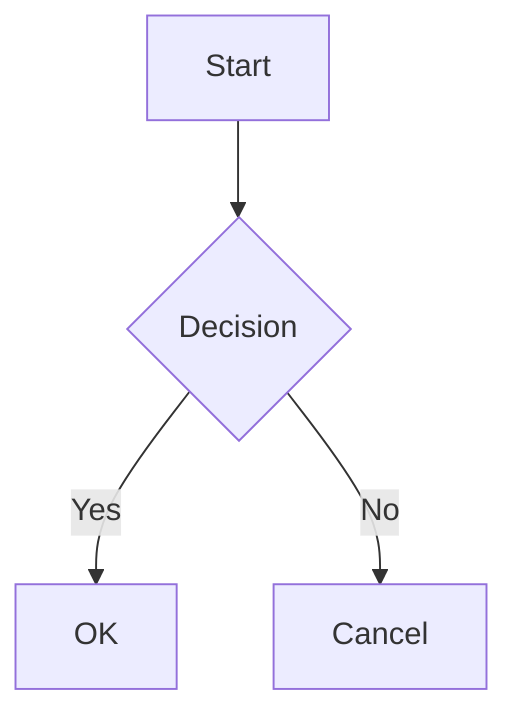

# @jet-w/astro-blog

A modern, feature-rich Astro blog theme with Vue and Tailwind CSS support. Provides a complete blogging solution with multi-language support, rich markdown capabilities, and interactive components.

**Official Website**: [https://jetw-astroblog.github.io/](https://jetw-astroblog.github.io/)

## Features

- **Multi-Language Support (i18n)** - Built-in internationalization with configurable locales
- **Blog System** - Posts, tags, categories, archives, and pagination
- **Search** - Full-text search powered by Fuse.js
- **RSS Feed** - Automatic RSS feed generation
- **Dark Mode** - Theme switching support
- **Rich Markdown** - Code highlighting, math equations (KaTeX), Mermaid diagrams, custom containers
- **Interactive Components** - Slides, ECharts, video embeds (YouTube, Bilibili)
- **Responsive Design** - Mobile-friendly layouts with Tailwind CSS

## Installation

```bash
npm install @jet-w/astro-blog
```

## Peer Dependencies

Make sure you have these packages installed:

```bash
npm install astro @astrojs/mdx @astrojs/rss @astrojs/tailwind @astrojs/vue tailwindcss vue
```

## Quick Start

### 1. Configure Astro

Add the integration to your `astro.config.mjs`:

```js
import { defineConfig } from 'astro/config';
import { astroBlog } from '@jet-w/astro-blog';

export default defineConfig({
  integrations: [astroBlog()],
});
```

### 2. Set Up Content Collections

Create `src/content/config.ts`:

```ts
import { defineCollection, z } from 'astro:content';

const posts = defineCollection({
  type: 'content',
  schema: z.object({
    title: z.string(),
    description: z.string().optional(),
    date: z.date(),
    tags: z.array(z.string()).optional(),
    categories: z.array(z.string()).optional(),
    draft: z.boolean().optional(),
  }),
});

export const collections = { posts };
```

### 3. Create Your First Post

Create a markdown file in `src/content/posts/`:

```markdown
---
title: Hello World
date: 2024-01-01
tags: [hello, first-post]
---

Welcome to my blog!
```

## Configuration

### Site Configuration

Create `src/config/site.ts`:

```ts
import { defineSiteConfig } from '@jet-w/astro-blog/config';

export default defineSiteConfig({
  title: 'My Blog',
  description: 'A blog about...',
  author: 'Your Name',
  lang: 'en',
});
```

### i18n Configuration

Create `src/config/i18n.ts`:

```ts
import { defineI18nConfig } from '@jet-w/astro-blog/config';

export default defineI18nConfig({
  defaultLocale: 'en',
  locales: ['en', 'zh-cn'],
  translations: {
    en: {
      'nav.home': 'Home',
      'nav.blog': 'Blog',
      // ...
    },
    'zh-cn': {
      'nav.home': '首页',
      'nav.blog': '博客',
      // ...
    },
  },
});
```

### Sidebar Configuration

Create `src/config/sidebar.ts`:

```ts
import { defineSidebarConfig } from '@jet-w/astro-blog/config';

export default defineSidebarConfig({
  // Manual configuration
  items: [
    { label: 'Getting Started', link: '/docs/getting-started' },
    { label: 'Guide', items: [...] },
  ],
  // Or use auto-scan
  autoScan: {
    directory: 'docs',
  },
});
```

## Layouts

The theme provides several layouts:

- **BaseLayout** - Standard page layout
- **PageLayout** - Blog post layout with sidebar
- **AboutLayout** - Profile/about page layout
- **SlidesLayout** - Presentation slides layout

```astro
---
import { PageLayout } from '@jet-w/astro-blog/layouts';
---

<PageLayout title="My Page">
  <p>Page content here</p>
</PageLayout>
```

## Components

Import components as needed:

```astro
---
import { SearchBox, ThemeToggle, LanguageSwitcher } from '@jet-w/astro-blog/components';
---

<SearchBox />
<ThemeToggle />
<LanguageSwitcher />
```

### Available Components

- **UI**: SearchBox, ThemeToggle, LanguageSwitcher, MobileMenu, Pagination
- **Blog**: NavigationTabs, RelatedPosts, TagList
- **Media**: Video, YouTube, Bilibili, Slides
- **About**: TagCard, SocialLinks, Timeline

## Markdown Extensions

### Custom Containers

```markdown
:::tip
This is a tip
:::

:::warning
This is a warning
:::

:::danger
This is dangerous
:::

:::details Summary
Hidden content here
:::
```

### Math Equations

```markdown
Inline: $E = mc^2$

Block:
$$
\int_0^\infty e^{-x^2} dx = \frac{\sqrt{\pi}}{2}
$$
```

### Mermaid Diagrams

````markdown

````

### Tabs

```markdown
:::tabs
@tab JavaScript
console.log('Hello');

@tab Python
print('Hello')
:::
```

## Project Structure

```
src/
├── components/     # Vue and Astro components
├── config/         # Configuration files
├── layouts/        # Layout templates
├── pages/          # Route pages
├── plugins/        # Markdown/MDX plugins
├── styles/         # Global styles
├── types/          # TypeScript definitions
└── utils/          # Utility functions
```

## License

[Apache 2.0](./LICENSE)

## Author

Haiyue

## Links

- [Official Website](https://jetw-astroblog.github.io/)
- [GitHub Repository](https://github.com/jetw-astroblog/jet-w.astro-blog)
- [NPM Package](https://www.npmjs.com/package/@jet-w/astro-blog)
